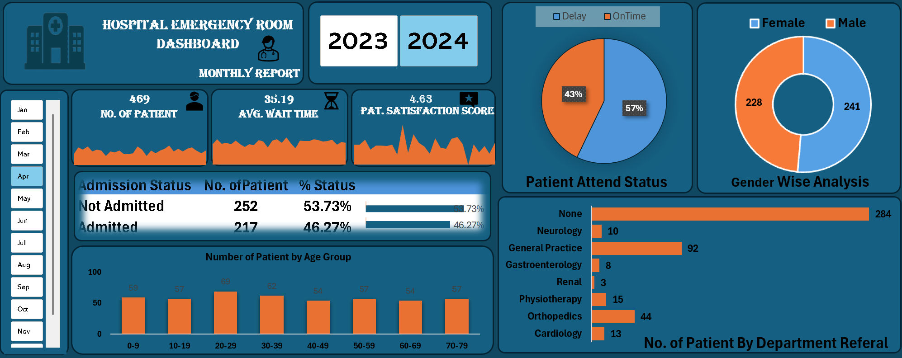

# Hospital Emergency Room Dashboard

## Overview

This project is an interactive Hospital Emergency Room Dashboard created in Microsoft Excel.

The dashboard helps analyze patient data such as:

- Number of Patients
- Average Wait Time
- Patient Satisfaction Score
- Admission Status
- Patient Age Groups
- Department Referral
- Gender Analysis
- Attendance Status

---

## Dashboard Preview

---

## Features

- Interactive Dashboard
- Monthly Filter
- Year Filter (2023 & 2024)
- KPI Cards
- Pie Charts
- Doughnut Chart
- Bar Charts
- Dynamic Analysis

---

## Tools Used

- Microsoft Excel
- Pivot Tables
- Pivot Charts
- Slicers
- Conditional Formatting

---

## File

Hospital_DashBoard.xlsx
